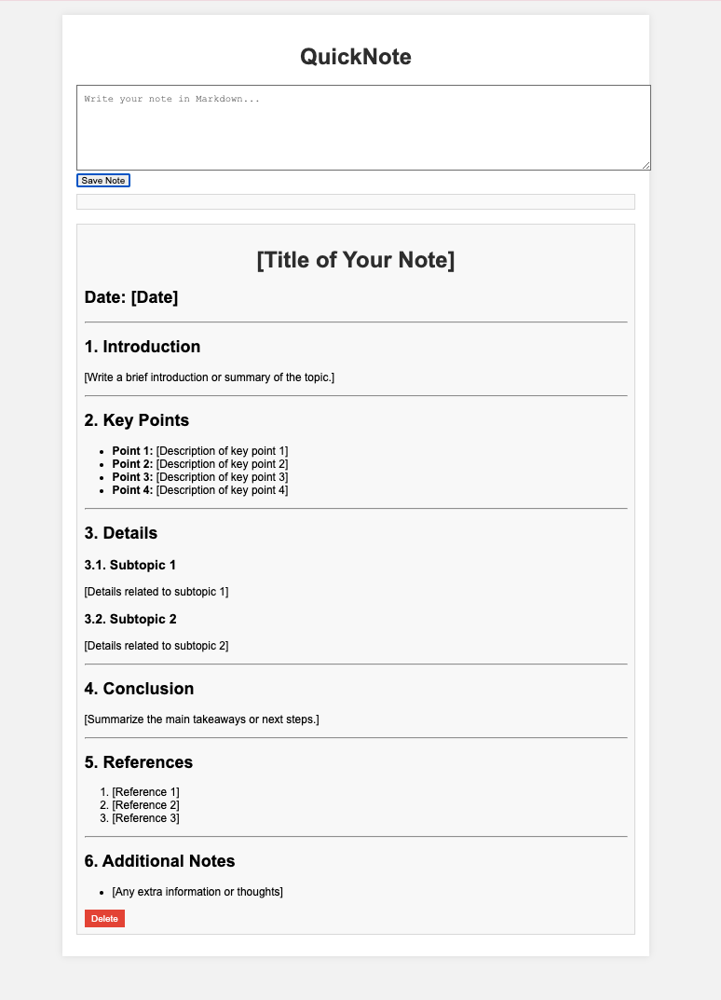

# QuickNote 📝



**QuickNote** is a simple, lightweight, and easy-to-use web-based note-taking application built with React and Vite. It allows users to create, edit, and organize notes in Markdown format, providing a distraction-free environment for jotting down ideas, code snippets, and to-do lists.

## Features 🚀

- **Markdown Support:** Write and preview notes in Markdown with real-time rendering.
- **Local Storage:** Automatically saves your notes to the browser's local storage.
- **Note Management:** Create, edit, delete, and organize your notes effortlessly.
- **Dark Mode:** Switch between light and dark themes for better readability.
- **Responsive Design:** Use it on any device, from desktops to smartphones.
- **Export Notes:** Export your notes as Markdown files.

## Demo 🌐

Check out the live demo of QuickNote [here](https://your-demo-url.com).

## Installation 🛠️

To get started with QuickNote on your local machine:

1. **Clone the repository:**
   ```bash
   git clone https://github.com/your-username/quicknote.git
   cd quicknote

2. **Install dependencies:**
   ```bash
   npm install

3. **Run the development server:**
   ```bash
   npm run dev

4. **Build for production:**
   ```bash
   npm run build

5. **Preview the production build:**
   ```bash
   npm run serve


## Usage 📖

1. **Creating Notes:**
- Start by typing your note in the Markdown editor.
- The preview panel on the right will display the formatted Markdown in real time.
- Click "Save Note" to store your note in local storage.

2. **Managing Notes:**
- View all saved notes in the "Notes List".
- Click on any note to view or edit it.
- Delete notes with the "Delete" button.

3. **Dark Mode:**
- Toggle dark mode using the theme switcher in the app.

## Contributing 🤝

Contributions are welcome! If you have suggestions for improvements, please feel free to open an issue or submit a pull request.

### How to Contribute

1. **Fork the repository**.
2. **Create a new branch** (`git checkout -b feature-name`).
3. **Make your changes** and commit them (`git commit -m 'Add some feature'`).
4. **Push to the branch** (`git push origin feature-name`).
5. **Open a pull request**.

## License 📄

This project is licensed under the MIT License - see the [LICENSE](LICENSE) file for details.

## Acknowledgements 🙏

- [Vite](https://vitejs.dev/) for the fast build tool.
- [React](https://reactjs.org/) for the powerful JavaScript library.
- [Marked](https://github.com/markedjs/marked) for the Markdown parsing.

## Contact 📬

If you have any questions, feel free to reach out via [tiantiancscs@gmail.com](mailto:tiantiancscs@gmail.com).

---

### Keywords

To ensure your project is discoverable, add relevant keywords to your README or repository's topics:

- `markdown note-taking`
- `react markdown editor`
- `vite react project`
- `web-based notes app`
- `lightweight note-taking`
- `quick notes react`
- `markdown preview`
- `react local storage`
- `markdown dark mode`
